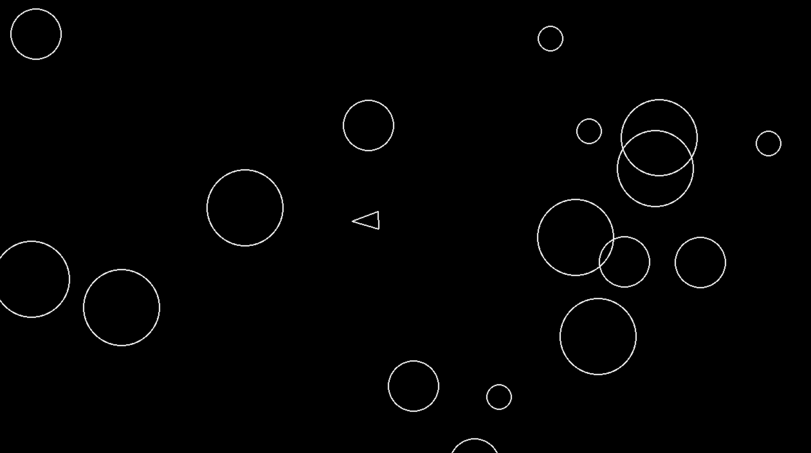

# asteroids

This game is a clone of the classic Asteroids game using Pygame and object-oriented programming concepts.

Was built as part of the boot.dev **Build Asteroids** guided project.

### Steps to setup the virtual env and installing pygame:
1. `python3 -m venv venv`
2. `source venv/bin/activate`
3. `pip install -r requirements.txt`